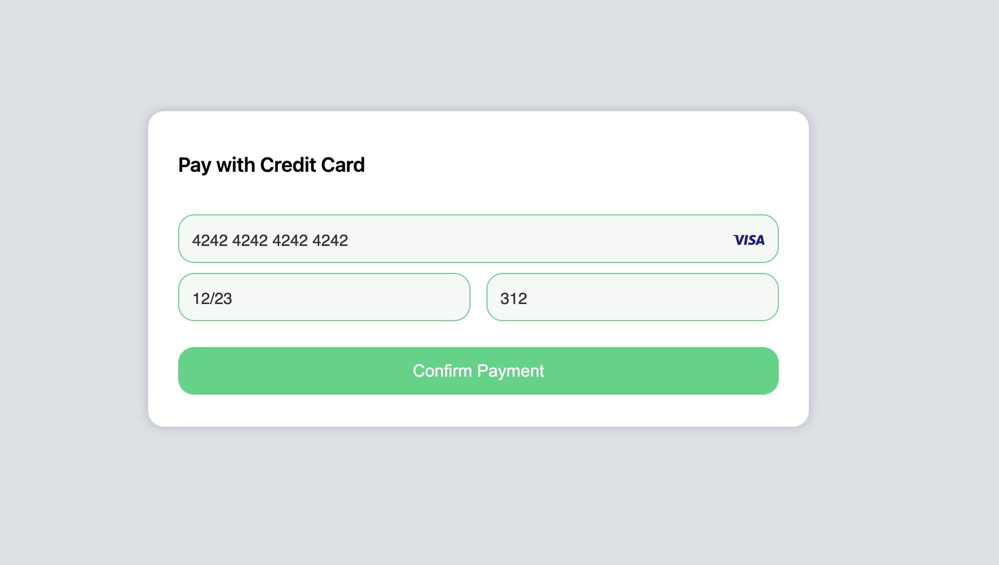
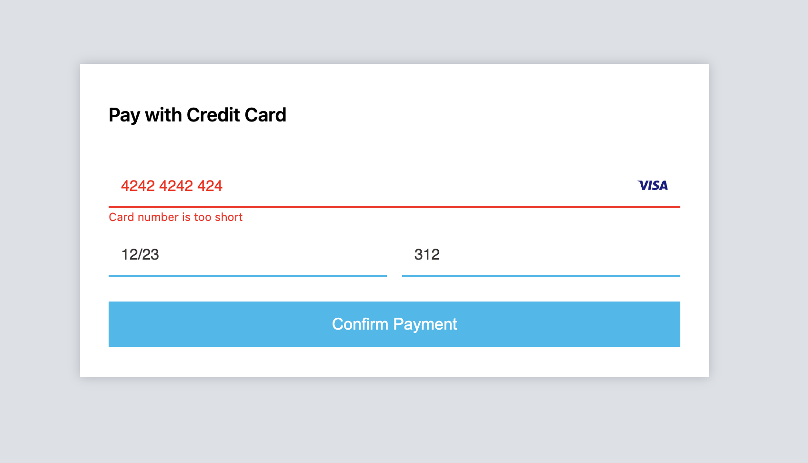
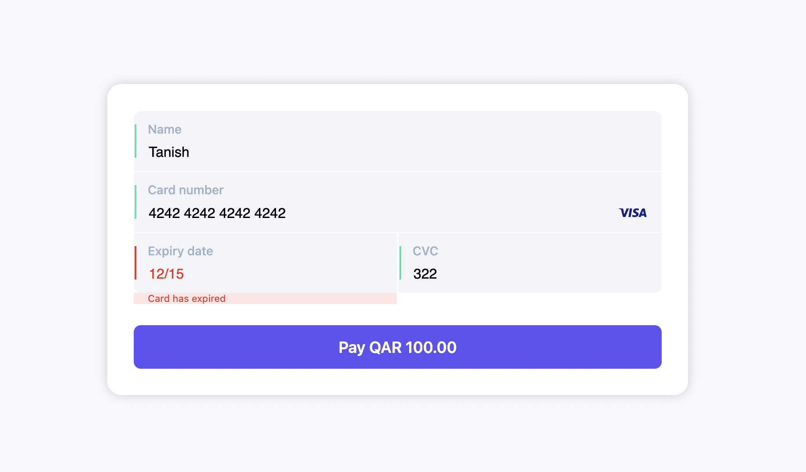

# Dibsy.JS Examples

This repository contains examples of different implementations of Dibsy.JS. Dibsy.JS is part of the Dibsy Component family, which allows you to securely collect sensitive data from your customer without needing to pass through your systems. While securing access to the data, you can fully control the look and feel of the input fields. At a high level, it works by using a Javascript API to add fields in a way that is fully PCI-DSS compliant. Moreover, we’re constantly extending Dibsy.JS functionality to bring additional value to our customers.

## Documentation

- [Integration guide](https://dibsy.dev/docs/dibsy-components/Dibsy-JS)
- [API reference](https://api.dibsy.dev/)

## Examples

- [Example 1](./example-1/): Basic example

<a href="./example-1/"></a>

- [Example 2](./example-2/): Floating labels

<a href="./example-2/"></a>

- [Example 3](./example-3/): Vertical layout

<a href="./example-3/"></a>

## Running locally

In order to run the examples you need a webserver. Although its plain HTML, CSS and JavaScript Mollie Components needs a valid hostname (e.g. localhost or 127.0.0.1). For this README example we use the [serve](https://www.npmjs.com/package/serve) package but any other webserver should work just fine.

1. Clone the repo

```bash
git clone git@github.com:dibsyhq/dibsy.js-examples.git
```

2. Navigate to the the repo

```bash
cd dibsy.js-examples
```

3. Serve the examples via a webserver

```bash
npx serve
```